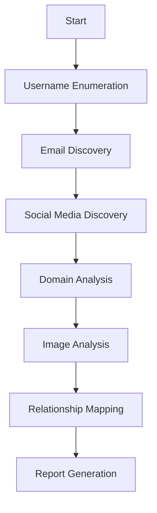

# Social Media Intelligence - OSINT Prompts

> A comprehensive collection of bilingual (English/Arabic) prompts for social media reconnaissance, profile analysis, and OSINT tool methodologies.

---

## Prompt 1: Social Media Profile Analysis

### Description
Conduct comprehensive social media profile analysis for authorized investigations including username enumeration, activity pattern analysis, and relationship mapping.

### Tags
`social-media` `profile-analysis` `osint` `username-enumeration` `digital-footprint`

---

## 🇬🇧 English Prompt

```
You are an OSINT specialist conducting authorized social media intelligence gathering. Perform a comprehensive social media profile analysis with the following methodology:

**Phase 1: Username Enumeration & Cross-Platform Discovery**
- Identify all social media platforms associated with the target username
- Document username variations and aliases used across platforms
- Analyze username patterns for potential password derivation hints
- Map account creation timelines and platform preferences

**Phase 2: Profile Content Analysis**
For each discovered profile, document:
- Profile picture analysis (reverse image search opportunities)
- Bio/description content and embedded links
- Location data and check-in history
- Employment and education history
- Interests, groups, and community affiliations
- Privacy settings assessment (what is visible vs. hidden)

**Phase 3: Activity Pattern Analysis**
- Posting frequency and timing patterns
- Content themes and topics of interest
- Interaction patterns (comments, likes, shares)
- Device and location metadata from posts
- Cross-platform content correlation

**Phase 4: Relationship Mapping**
- Identify key connections and network analysis
- Document family member associations
- Map professional network connections
- Analyze group memberships and affiliations
- Identify mutual connections for verification

**Phase 5: Digital Footprint Aggregation**
- Compile all discovered email addresses
- Document phone numbers and contact information
- List all discovered usernames and aliases
- Aggregate location history and movements
- Identify potential security question answers

**OSINT Tools Reference:**
- Namechk, KnowEm, Sherlock for username enumeration
- Social Search Engines (SocialBlade, SocialSearcher)
- Reverse image search (Yandex, TineEye, Google Images)
- Archive services (Wayback Machine, Archive.today)
- Email validation tools (Hunter.io, EmailRep)

**Output Requirements:**
- Structured profile summary report
- Visual relationship map
- Timeline of digital activity
- Risk assessment of exposed information
- Privacy recommendations

**Ethical Considerations:**
- Document authorization and legal basis
- Operate within platform Terms of Service
- Do not bypass privacy settings or use social engineering
- Report only lawfully obtained information
- Include data retention and deletion procedures
```

---

## 🇸🇦 Arabic Prompt | المطلب بالعربية

```
أنت متخصص في الاستخبارات مفتوحة المصدر (OSINT) تجري جمع معلومات من وسائل التواصل الاجتماعي مصرح بها. قم بإجراء تحليل شامل لملفات وسائل التواصل الاجتماعي بالمنهجية التالية:

**المرحلة 1: تعداد اسم المستخدم والاكتشاف عبر المنصات**
- تحديد جميع منصات التواصل الاجتماعي المرتبطة باسم المستخدم المستهدف
- توثيق اختلافات اسم المستخدم والأسماء المستعارة المستخدمة عبر المنصات
- تحليل أنماط أسماء المستخدمين للتلميحات المحتملة لاشتقاق كلمات المرور
- رسم خريطة جداول إنشاء الحسابات وتفضيلات المنصات

**المرحلة 2: تحليل محتوى الملف الشخصي**
لكل ملف شخصي مكتشف، وثّق:
- تحليل صورة الملف (فرص البحث العكسي عن الصور)
- محتوى السيرة/الوصف والروابط المضمنة
- بيانات الموقع وسجل تسجيل الدخول
- تاريخ التوظيف والتعليم
- الاهتمامات والمجموعات والانتماءات المجتمعية
- تقييم إعدادات الخصوصية (ما هو مرئي مقابل مخفي)

**المرحلة 3: تحليل أنماط النشاط**
- تكرار النشر وأنماط التوقيت
- مواضيع المحتوى واهتمامات الموضوع
- أنماط التفاعل (التعليقات، الإعجابات، المشاركات)
- بيانات الجهاز والموقع من المنشورات
- الارتباط بين المحتوى عبر المنصات

**المرحلة 4: رسم خريطة العلاقات**
- تحديد الروابط الرئيسية وتحليل الشبكة
- توثيق ارتباطات أفراد الأسرة
- رسم خريطة اتصالات الشبكة المهنية
- تحليل عضويات المجموعات والانتماءات
- تحديد الاتصالات المشتركة للتحقق

**المرحلة 5: تجميع البصمة الرقمية**
- تجميع جميع عناوين البريد الإلكتروني المكتشفة
- توثيق أرقام الهواتف ومعلومات الاتصال
- قائمة جميع أسماء المستخدمين والأسماء المستعارة المكتشفة
- تجميع سجل المواقع والتحركات
- تحديد إجابات أسئلة الأمان المحتملة

**أدوات OSINT المرجعية:**
- Namechk, KnowEm, Sherlock لتعداد أسماء المستخدمين
- محركات البحث الاجتماعي (SocialBlade, SocialSearcher)
- البحث العكسي عن الصور (Yandex, TineEye, Google Images)
- خدمات الأرشفة (Wayback Machine, Archive.today)
- أدوات التحقق من البريد الإلكتروني (Hunter.io, EmailRep)

**متطلبات المخرجات:**
- تقرير ملخص للملف الشخصي منظم
- خريطة علاقات بصرية
- جدول زمني للنشاط الرقمي
- تقييم المخاطر للمعلومات المكشوفة
- توصيات الخصوصية

**الاعتبارات الأخلاقية:**
- توثيق الترخيص والأساس القانوني
- العمل ضمن شروط خدمة المنصة
- عدم تجاوز إعدادات الخصوصية أو استخدام الهندسة الاجتماعية
- الإبلاغ عن المعلومات التي تم الحصول عليها قانونياً فقط
- تضمين إجراءات الاحتفاظ بالبيانات وحذفها
```

---

## Example Output Preview

```
# Social Media Intelligence Report

## Target Profile Summary
**Primary Username:** jsmith_dev
**Real Name:** John Smith
**Discovered Platforms:** 12

### Platform Presence Matrix
| Platform | Username | Account Age | Privacy | Activity Level |
|----------|----------|-------------|---------|----------------|
| LinkedIn | jsmith-dev | 8 years | Public | High |
| Twitter/X | jsmith_dev | 6 years | Public | Medium |
| GitHub | jsmith-dev | 7 years | Public | High |
| Facebook | john.smith.1234 | 10 years | Private | Low |
| Instagram | jsmith_travels | 4 years | Private | Medium |

### Digital Footprint Findings
**Email Addresses Discovered:**
- j.smith@company.com (verified)
- johnsmith.dev@gmail.com (verified)
- jsmith2015@outlook.com (unverified)

**Location Intelligence:**
- Current: San Francisco, CA (LinkedIn, recent posts)
- Previous: Austin, TX (2018-2021)
- Hometown: Chicago, IL

### Security Risk Assessment
**High Risk Items:**
- Birthday visible on Facebook (Jan 15, 1990)
- Pet name "Max" frequently mentioned (potential security question)
- Mother's maiden name hinted in family posts
- Work anniversary dates publicly visible

**Recommendations:**
1. Enable 2FA on all accounts
2. Remove birthday visibility
3. Audit privacy settings across platforms
4. Consider username consistency reduction
```

---

## Target Models
- GPT-4
- Claude
- Gemini

## Author
- CyberSec-Prompts-Hub Team

---

## Prompt 2: Social Network Mapping & Analysis

### Description
Map and analyze social networks to identify key influencers, community structures, information flow patterns, and relationship dynamics using graph analysis techniques.

### Tags
`social-network-analysis` `relationship-mapping` `graph-analysis` `influence-analysis` `community-detection`

---

## 🇬🇧 English Prompt

```
You are a social network analyst conducting authorized OSINT investigations. Develop a comprehensive social network mapping and analysis framework:

**Part 1: Data Collection Strategy**
Identify collection methods for:
- Direct connections (friends, followers, following)
- Interaction data (comments, mentions, shares, reactions)
- Group and community memberships
- Event attendance and participation
- Content co-creation collaborations

**Part 2: Network Structure Analysis**
For the collected network, analyze:
- Network density and clustering coefficients
- Centrality measures (degree, betweenness, closeness, eigenvector)
- Community detection and sub-group identification
- Key influencer identification
- Bridge nodes and boundary spanners
- Isolated clusters and disconnected components

**Part 3: Relationship Classification**
Categorize discovered relationships:
- Strong ties (frequent interaction, mutual engagement)
- Weak ties (occasional interaction, one-way engagement)
- Professional connections
- Personal/family relationships
- Interest-based affiliations
- Dormant or historical connections

**Part 4: Information Flow Analysis**
Map information propagation patterns:
- Content sharing pathways
- Amplification patterns and viral potential
- Echo chamber identification
- Cross-community information bridges
- Timing and frequency of interactions

**Part 5: Temporal Network Analysis**
Examine network evolution:
- Relationship formation timeline
- Connection decay patterns
- Seasonal activity variations
- Life event impacts on network structure
- Migration between platforms

**Analysis Tools & Techniques:**
- Gephi, NetworkX, Neo4j for visualization
- Python libraries (networkx, igraph, graph-tool)
- Social network analysis metrics
- Machine learning for link prediction
- Natural language processing for interaction analysis

**Output Requirements:**
- Interactive network visualization
- Statistical network metrics report
- Key influencer profiles
- Community structure analysis
- Information flow diagrams
- Risk assessment for target identification
```

---

## 🇸🇦 Arabic Prompt | المطلب بالعربية

```
أنت محلل شبكات اجتماعية تجري تحقيقات OSINT مصرح بها. طور إطاراً شاملاً لرسم خرائط وتحليل الشبكات الاجتماعية:

**الجزء 1: استراتيجية جمع البيانات**
حدد طرق جمع:
- الاتصالات المباشرة (الأصدقاء، المتابعون، المتابع)
- بيانات التفاعل (التعليقات، الإشارات، المشاركات، ردود الفعل)
- عضويات المجموعات والمجتمعات
- حضور الأحداث والمشاركة
- تعاون إنشاء المحتوى المشترك

**الجزء 2: تحليل هيكل الشبكة**
للشبكة المجمعة، حلل:
- كثافة الشبكة ومعاملات التجميع
- مقاييس المركزية (الدرجة، الوساطة، القرب، المتجه الذاتي)
- كشف المجتمعات وتحديد المجموعات الفرعية
- تحديد المؤثرين الرئيسيين
- العقد الجسور والحدوديون
- المجموعات المعزولة والمكونات المنفصلة

**الجزء 3: تصنيف العلاقات**
صنف العلاقات المكتشفة:
- روابط قوية (تفاعل متكرر، تفاعل متبادل)
- روابط ضعيفة (تفاعل متقطع، تفاعل أحادي)
- اتصالات مهنية
- علاقات شخصية/عائلية
- انتماءات قائمة على الاهتمام
- اتصالات خاملة أو تاريخية

**الجزء 4: تحليل تدفق المعلومات**
ارسم أنماط انتشار المعلومات:
- مسارات مشاركة المحتوى
- أنماط التضخيم والإمكانية الفيروسية
- تحديد غرف الصدى
- جسور المعلومات عبر المجتمعات
- توقيت وتكرار التفاعلات

**الجزء 5: تحليل الشبكة الزمني**
افحص تطور الشبكة:
- الجدول الزمني لتكوين العلاقات
- أنماط اضمحلال الاتصال
- التباينات الموسمية في النشاط
- تأثيرات أحداث الحياة على هيكل الشبكة
- الهجرة بين المنصات

**أدوات وتقنيات التحليل:**
- Gephi, NetworkX, Neo4j للتصور
- مكتبات Python (networkx, igraph, graph-tool)
- مقاييس تحليل الشبكات الاجتماعية
- التعلم الآلي للتنبؤ بالروابط
- معالجة اللغة الطبيعية لتحليل التفاعل

**متطلبات المخرجات:**
- تصور تفاعلي للشبكة
- تقرير مقاييس الشبكة الإحصائية
- ملفات تعريف المؤثرين الرئيسيين
- تحليل هيكل المجتمع
- مخططات تدفق المعلومات
- تقييم المخاطر لتحديد الهدف
```

---

## Example Output Preview

```
# Social Network Analysis Report

## Network Overview
**Total Nodes:** 847
**Total Edges:** 3,241
**Network Density:** 0.009
**Average Degree:** 7.65
**Clustering Coefficient:** 0.34

## Centrality Analysis - Top 5 Influencers

| Rank | User | Degree | Betweenness | Eigenvector | Role |
|------|------|--------|-------------|-------------|------|
| 1 | @target_user | 156 | 0.0823 | 0.891 | Hub |
| 2 | @colleague_a | 134 | 0.0756 | 0.845 | Bridge |
| 3 | @manager_b | 98 | 0.0612 | 0.812 | Authority |
| 4 | @mentor_c | 87 | 0.0534 | 0.789 | Influencer |
| 5 | @peer_d | 76 | 0.0489 | 0.756 | Connector |

## Community Detection Results
**Communities Found:** 6
**Modularity Score:** 0.42

### Community Breakdown
- Community A (Work): 234 members, 89% professional content
- Community B (Family): 156 members, high interaction frequency
- Community C (Interest Group): 198 members, topic-specific
- Community D (Alumni): 145 members, historical connections
- Community E (Location): 67 members, geographic clustering
- Community F (Mixed): 47 members, cross-category

## Information Flow Analysis
**Key Findings:**
- Average path length: 3.2 hops
- Diameter: 7 hops
- Most efficient spreaders: @target_user, @colleague_a
- Echo chamber detected in Community C (modularity = 0.68)
- Bridge nodes between work and personal: 12 identified
```

---

## Target Models
- GPT-4
- Claude
- Gemini

## Author
- CyberSec-Prompts-Hub Team

---

## Prompt 3: OSINT Tool Integration & Workflow

### Description
Design comprehensive OSINT workflows integrating multiple tools and data sources for efficient intelligence gathering, automation, and report generation.

### Tags
`osint-tools` `automation` `workflow` `tool-integration` `intelligence-gathering`

---

## 🇬🇧 English Prompt

```
You are an OSINT operations specialist designing automated intelligence gathering workflows. Create a comprehensive tool integration and workflow framework:

**Section 1: Tool Inventory & Classification**

**Username & Account Discovery:**
- Sherlock, Maigret, Social-Analyzer
- Namechk, KnowEm, UserSearch
- WhatsMyName, SpiderFoot

**Domain & Infrastructure:**
- WHOIS lookup tools, DomainTools
- DNSDumpster, Sublist3r
- Shodan, Censys, BinaryEdge

**Email Intelligence:**
- Hunter.io, EmailRep, Have I Been Pwned
- Holehe, Ghunt, EmailHarvester
- MailTester, VerifyEmail

**Image & Video Analysis:**
- Google Images, Yandex, TineEye
- ExifTool, InVID, FotoForensics
- PimEyes, FaceCheck.id

**Social Media Specific:**
- CrowdTangle, SocialBlade
- TweetDeck, SocialSearcher
- Story archivers for ephemeral content

**Section 2: Automated Workflow Design**
Create step-by-step workflows for:
1. Initial target assessment
2. Username enumeration pipeline
3. Email harvesting and validation
4. Social media profile discovery
5. Image and media analysis
6. Relationship mapping
7. Report generation

**Section 3: API Integration Framework**
Document integration with:
- Social media APIs (Twitter, LinkedIn)
- Threat intelligence platforms
- Background check services
- Geolocation services
- Translation services

**Section 4: Data Management**
- Evidence preservation protocols
- Chain of custody documentation
- Data encryption and storage
- Retention and deletion policies
- Cross-case data correlation

**Section 5: Quality Assurance**
- Source verification methodology
- False positive identification
- Confidence scoring system
- Peer review processes
- Legal compliance checklist

**Automation Scripts:**
Provide Python/bash script templates for:
- Multi-tool orchestration
- API data aggregation
- Automated screenshot capture
- Report template population
- Alert generation

**Output Requirements:**
- Workflow diagram documentation
- Tool configuration guides
- API integration examples
- Sample automation scripts
- Quality assurance checklists
```

---

## 🇸🇦 Arabic Prompt | المطلب بالعربية

```
أنت متخصص في عمليات OSINT تصمم سير عمل آلية لجمع الاستخبارات. أنشئ إطاراً شاملاً لتكامل الأدوات وسير العمل:

**القسم 1: جرد الأدوات وتصنيفها**

**اكتشاف أسماء المستخدمين والحسابات:**
- Sherlock, Maigret, Social-Analyzer
- Namechk, KnowEm, UserSearch
- WhatsMyName, SpiderFoot

**النطاقات والبنية التحتية:**
- أدوات البحث WHOIS, DomainTools
- DNSDumpster, Sublist3r
- Shodan, Censys, BinaryEdge

**استخبارات البريد الإلكتروني:**
- Hunter.io, EmailRep, Have I Been Pwned
- Holehe, Ghunt, EmailHarvester
- MailTester, VerifyEmail

**تحليل الصور والفيديو:**
- Google Images, Yandex, TineEye
- ExifTool, InVID, FotoForensics
- PimEyes, FaceCheck.id

**أدوات وسائل التواصل الاجتماعي:**
- CrowdTangle, SocialBlade
- TweetDeck, SocialSearcher
- أرشيفي القصص للمحتوى المؤقت

**القسم 2: تصميم سير العمل الآلي**
أنشئ سير عمل خطوة بخطوة لـ:
1. تقييم الهدف الأولي
2. خط أنابيب تعداد اسم المستخدم
3. حصاد والتحقق من البريد الإلكتروني
4. اكتشاف ملفات التواصل الاجتماعي
5. تحليل الصور والوسائط
6. رسم خريطة العلاقات
7. إنشاء التقارير

**القسم 3: إطار تكامل API**
وثّق التكامل مع:
- واجهات برمجة التواصل الاجتماعي (Twitter, LinkedIn)
- منصات استخبارات التهديدات
- خدمات فحص الخلفية
- خدمات تحديد الموقع الجغرافي
- خدمات الترجمة

**القسم 4: إدارة البيانات**
- بروتوكولات حفظ الأدلة
- توثيق سلسلة الحيازة
- تشفير وتخزين البيانات
- سياسات الاحتفاظ والحذف
- الارتباط بين البيانات عبر الحالات

**القسم 5: ضمان الجودة**
- منهجية التحقق من المصدر
- تحديد الإيجابيات الكاذبة
- نظام تقييم الثقة
- عمليات مراجعة الأقران
- قائمة التحقق للامتثال القانوني

**نصوص الأتمتة:**
قدم قوالب نصوص Python/bash لـ:
- تنسيق الأدوات المتعددة
- تجميع بيانات API
- التقاط لقطات شاشة آلية
- تعبئة قوالب التقارير
- إنشاء التنبيهات

**متطلبات المخرجات:**
- توثيق مخطط سير العمل
- أدلة تكوين الأدوات
- أمثلة تكامل API
- نصوص أتمتة نموذجية
- قوائم تحقق ضمان الجودة
```

---

## Example Output Preview

```
# OSINT Workflow Documentation

## Workflow 1: Initial Target Assessment



## Automation Script - Username Enumeration

```python
#!/usr/bin/env python3
"""
OSINT Username Enumeration Workflow
"""
import subprocess
import json
from concurrent.futures import ThreadPoolExecutor

def run_sherlock(username):
    """Run Sherlock for username enumeration"""
    result = subprocess.run(
        ['python3', 'sherlock/sherlock.py', username, '--json', '--output', 'results.json'],
        capture_output=True, text=True
    )
    return json.loads(open('results.json').read())

def run_maigret(username):
    """Run Maigret for additional coverage"""
    result = subprocess.run(
        ['maigret', username, '--json', '-o', 'maigret_results.json'],
        capture_output=True, text=True
    )
    return json.loads(open('maigret_results.json').read())

def aggregate_results(sherlock_data, maigret_data):
    """Combine and deduplicate results"""
    all_platforms = set(sherlock_data.keys()) | set(maigret_data.keys())
    return {
        platform: {
            'url': sherlock_data.get(platform, {}).get('url') or 
                   maigret_data.get(platform, {}).get('url'),
            'status': 'found'
        }
        for platform in all_platforms
        if sherlock_data.get(platform, {}).get('status') == 'found' or
           maigret_data.get(platform, {}).get('status') == 'found'
    }

def main(username):
    with ThreadPoolExecutor(max_workers=2) as executor:
        sherlock_future = executor.submit(run_sherlock, username)
        maigret_future = executor.submit(run_maigret, username)
        
        sherlock_results = sherlock_future.result()
        maigret_results = maigret_future.result()
    
    final_results = aggregate_results(sherlock_results, maigret_results)
    print(f"[+] Found {len(final_results)} profiles for username: {username}")
    return final_results

if __name__ == "__main__":
    import sys
    main(sys.argv[1])
```

## Tool Configuration Matrix

| Tool | Purpose | API Required | Rate Limit | Output Format |
|------|---------|--------------|------------|---------------|
| Sherlock | Username Search | No | N/A | JSON/TXT |
| Hunter.io | Email Discovery | Yes | 25/mo free | JSON |
| Shodan | Infrastructure | Yes | 100/mo free | JSON |
| SpiderFoot | Aggregation | No | N/A | JSON/HTML |
```

---

## Target Models
- GPT-4
- Claude
- Gemini

## Author
- CyberSec-Prompts-Hub Team

---

## Prompt 4: Geolocation Intelligence from Social Media

### Description
Extract and analyze geolocation data from social media content including metadata analysis, image geolocation, check-in patterns, and movement tracking.

### Tags
`geolocation` `location-intelligence` `metadata-analysis` `movement-tracking` `image-forensics`

---

## 🇬🇧 English Prompt

```
You are a geolocation intelligence specialist conducting authorized OSINT investigations. Develop a comprehensive geolocation analysis framework:

**Section 1: Location Data Sources**
Identify and categorize location data from:
- Explicit check-ins and location tags
- Image metadata (EXIF GPS data)
- Geotagged posts and media
- Background landmarks and identifiable features
- Text-based location references
- Event attendance records
- Travel patterns from sequential posts

**Section 2: Image Geolocation Techniques**

**Metadata Extraction:**
- EXIF data analysis (GPS coordinates, timestamps, device info)
- Metadata stripping detection
- Screenshot vs. original image identification

**Visual Geolocation:**
- Landmark identification methodology
- Street view correlation techniques
- Architectural style analysis
- Vegetation and climate indicators
- Vehicle registration plate analysis
- Business signage and storefront identification
- Power outlet and infrastructure analysis

**Section 3: Pattern Analysis**
- Routine location identification (home, work, frequented places)
- Travel route reconstruction
- Timing pattern correlation
- Seasonal location variations
- Event-based movement prediction

**Section 4: Cross-Platform Location Correlation**
- Matching locations across different platforms
- Timestamp synchronization for movement tracking
- Identifying location sharing settings across platforms
- Multi-source verification techniques

**Section 5: Mapping & Visualization**
- Heat map generation for activity concentration
- Timeline visualization with geographic overlay
- Route mapping and analysis
- Proximity analysis for relationship inference
- Safe zone identification

**Tools & Resources:**
- ExifTool for metadata extraction
- Google Earth Pro, Maps, Street View
- Wikimapia, OpenStreetMap
- SunCalc for sun position analysis
- Weather data correlation
- Flight tracking (FlightRadar24, ADS-B)

**Output Requirements:**
- Location history timeline
- Heat map visualization
- Key locations profile
- Movement pattern analysis
- Risk assessment for location privacy
```

---

## 🇸🇦 Arabic Prompt | المطلب بالعربية

```
أنت متخصص في استخبارات الموقع الجغرافي تجري تحقيقات OSINT مصرح بها. طور إطاراً شاملاً لتحليل الموقع الجغرافي:

**القسم 1: مصادر بيانات الموقع**
حدد وصنف بيانات الموقع من:
- تسجيلات الدخول والعلامات المكانية الصريحة
- بيانات وصف الصور (بيانات EXIF GPS)
- المنشورات والوسائط الموسومة جغرافياً
- المعالم والملامح القابلة للتحديد في الخلفية
- مراجع الموقع النصية
- سجلات حضور الفعاليات
- أنماط السفر من المنشورات المتسلسلة

**القسم 2: تقنيات تحديد الموقع الجغرافي للصور**

**استخراج البيانات الوصفية:**
- تحليل بيانات EXIF (إحداثيات GPS، الطوابع الزمنية، معلومات الجهاز)
- كشف إزالة البيانات الوصفية
- تحديد لقطة الشاشة مقابل الصورة الأصلية

**التحديد الجغرافي البصري:**
- منهجية تحديد المعالم
- تقنيات الارتباط مع عرض الشارع
- تحليل النمط المعماري
- مؤشرات الغطاء النباتي والمناخ
- تحليل لوحات تسجيل المركبات
- تحديد اللافتات التجارية وواجهات المتاجر
- تحليل المقابس الكهربائية والبنية التحتية

**القسم 3: تحليل الأنماط**
- تحديد المواقع الروتينية (المنزل، العمل، الأماكن المتكررة)
- إعادة بناء مسارات السفر
- ارتباط أنماط التوقيت
- التباينات الموسمية في الموقع
- التنبؤ بالحركة بناءً على الأحداث

**القسم 4: الارتباط المكاني عبر المنصات**
- مطابقة المواقع عبر منصات مختلفة
- تزامن الطوابع الزمنية لتتبع الحركة
- تحديد إعدادات مشاركة الموقع عبر المنصات
- تقنيات التحقق متعددة المصادر

**القسم 5: الخرائط والتصور**
- توليد خرائط حرارية لتركيز النشاط
- تصور الجدول الزمني مع تراكب جغرافي
- رسم خرائط المسارات وتحليلها
- تحليل القرب لاستنتاج العلاقات
- تحديد المنطقة الآمنة

**الأدوات والموارد:**
- ExifTool لاستخراج البيانات الوصفية
- Google Earth Pro, Maps, Street View
- Wikimapia, OpenStreetMap
- SunCalc لتحليل موقع الشمس
- ارتباط بيانات الطقس
- تتبع الرحلات (FlightRadar24, ADS-B)

**متطلبات المخرجات:**
- جدول زمني لتاريخ المواقع
- تصور خريطة حرارية
- ملف المواقع الرئيسية
- تحليل أنماط الحركة
- تقييم المخاطر لخصوصية الموقع
```

---

## Example Output Preview

```
# Geolocation Intelligence Report

## Target Location Profile

### Key Locations Identified

**Primary Residence (High Confidence)**
- Location: 37.7749° N, 122.4194° W (San Francisco, CA)
- Evidence: 23 posts, EXIF data, recurring morning posts
- Activity Pattern: 10 PM - 7 AM presence
- First Confirmed: January 2023

**Work Location (High Confidence)**
- Location: 37.7879° N, 122.4072° W (Financial District)
- Evidence: LinkedIn profile, check-ins, commute patterns
- Activity Pattern: Weekdays 8 AM - 6 PM
- Building Identified: [Company Name] HQ

**Frequented Locations (Medium Confidence)**
| Location Type | Coordinates | Frequency | Evidence |
|--------------|-------------|-----------|----------|
| Gym | 37.7851°N, 122.4124°W | 3x/week | Check-ins, outfit patterns |
| Coffee Shop | 37.7832°N, 122.4089°W | Daily | Morning posts, WiFi network |
| Grocery | 37.7791°N, 122.4156°W | Weekly | Weekend afternoon pattern |

### Movement Pattern Analysis

**Daily Routine:**
```
6:30 AM - Depart residence
7:00 AM - Coffee shop (15 min)
7:30 AM - Arrive work
6:00 PM - Depart work
6:30 PM - Gym (Mon/Wed/Fri)
8:00 PM - Return home
```

**Travel History (Past 12 Months):**
- Las Vegas, NV: March 2024 (3 days)
- Seattle, WA: January 2024 (2 days)
- Los Angeles, CA: December 2023 (4 days)

### Image Geolocation Examples

**Image Analysis - Beach Photo (June 2024)**
- EXIF GPS: Stripped (screenshot detected)
- Visual Analysis: Golden Gate Bridge visible in background
- Estimated Location: Baker Beach, San Francisco
- Confidence: High (matched with check-in same day)

### Privacy Risk Assessment
**Critical:** Home address deducible from patterns
**High:** Work location publicly associated
**Medium:** Daily routine predictable
**Recommendation:** Disable geotagging, vary routines
```

---

## Target Models
- GPT-4
- Claude
- Gemini

## Author
- CyberSec-Prompts-Hub Team

---

## Prompt 5: Social Media Threat Monitoring

### Description
Design comprehensive social media threat monitoring programs for brand protection, executive protection, and organizational security awareness.

### Tags
`threat-monitoring` `brand-protection` `executive-protection` `security-monitoring` `alert-systems`

---

## 🇬🇧 English Prompt

```
You are a security operations specialist designing social media threat monitoring capabilities. Develop a comprehensive threat monitoring program:

**Section 1: Threat Categories**
Define monitoring scope for:

**Brand Threats:**
- Impersonation accounts and phishing attempts
- Trademark infringement and brand abuse
- Defamation and disinformation campaigns
- Counterfeit product promotion
- Customer data exposure

**Physical Security Threats:**
- Direct threats against executives or employees
- Location disclosure and stalking risks
- Protest and demonstration monitoring
- Facility reconnaissance indicators
- Travel-related threats

**Cybersecurity Threats:**
- Credential exposure and data breaches
- Phishing kit promotion
- Malicious domain registrations
- Social engineering attack planning
- Insider threat indicators

**Reputational Risks:**
- Negative sentiment spikes
- Viral complaint identification
- Employee conduct issues
- Association with controversial content

**Section 2: Monitoring Infrastructure**

**Keyword & Hashtag Monitoring:**
- Organization name variations
- Executive names and titles
- Product names and slogans
- Known threat actor handles
- Industry-specific threat terms
- Location-based monitoring

**Alert Configuration:**
- Real-time alert criteria
- Escalation thresholds
- False positive filtering
- Priority classification matrix
- Response SLA definitions

**Section 3: Intelligence Collection**
- Platform-specific monitoring approaches
- Deep/dark web crossover monitoring
- Threat actor tracking methodology
- Sentiment analysis implementation
- Trend detection algorithms

**Section 4: Response Protocols**
- Takedown request procedures
- Platform reporting mechanisms
- Law enforcement liaison protocols
- Internal communication templates
- Evidence preservation requirements

**Section 5: Metrics & Reporting**
- Key performance indicators
- Threat detection rates
- Response time metrics
- False positive tracking
- Executive dashboard design

**Tools & Platforms:**
- Social listening platforms (Brandwatch, Sprinklr)
- Threat intelligence platforms
- OSINT tools integration
- Automated alert systems
- Sentiment analysis tools

**Output Requirements:**
- Monitoring playbook
- Alert configuration guide
- Response workflow documentation
- Metrics dashboard specifications
- Training materials for analysts
```

---

## 🇸🇦 Arabic Prompt | المطلب بالعربية

```
أنت متخصص في عمليات الأمن تصمم قدرات مراقبة تهديدات وسائل التواصل الاجتماعي. طور برنامج مراقبة تهديدات شاملاً:

**القسم 1: فئات التهديدات**
حدد نطاق المراقبة لـ:

**تهديدات العلامة التجارية:**
- الحسابات المنتحلة ومحاولات التصيد
- انتهاك العلامات التجارية وإساءة استخدام العلامة
- حملات التشهير والمعلومات المضللة
- الترويج للمنتجات المقلدة
- كشف بيانات العملاء

**تهديدات الأمن المادي:**
- تهديدات مباشرة ضد التنفيذيين أو الموظفين
- كشف الموقع ومخاطر المطاردة
- مراقبة الاحتجاجات والمظاهرات
- مؤشرات استطلاع المنشآت
- التهديدات المتعلقة بالسفر

**تهديدات الأمن السيبراني:**
- كشف بيانات الاعتماد واختراقات البيانات
- الترويج لأدوات التصيد
- تسجيل النطاقات الخبيثة
- التخطيط لهجمات الهندسة الاجتماعية
- مؤشرات التهديد الداخلي

**مخاطر السمعة:**
- ارتفاعات المشاعر السلبية
- تحديد الشكاوى الفيروسية
- قضايا سلوك الموظفين
- الارتباط بالمحتوى المثير للجدل

**القسم 2: البنية التحتية للمراقبة**

**مراقبة الكلمات الرئيسية والهاشتاغات:**
- اختلافات اسم المنظمة
- أسماء وألقاب التنفيذيين
- أسماء المنتجات والشعارات
- معرفات جهات التهديد المعروفة
- مصطلحات التهديد الخاصة بالصناعة
- مراقبة قائمة على الموقع

**تكوين التنبيهات:**
- معايير التنبيه الفوري
- عتبات التصعيد
- تصفية الإيجابيات الكاذبة
- مصفوفة تصنيف الأولوية
- تعريفات SLA للاستجابة

**القسم 3: جمع الاستخبارات**
- مناهج المراقبة الخاصة بكل منصة
- مراقبة التقاطع مع الويب العميق/المظلم
- منهجية تتبع جهات التهديد
- تنفيذ تحليل المشاعر
- خوارزميات كشف الاتجاهات

**القسم 4: بروتوكولات الاستجابة**
- إجراءات طلبات الإزالة
- آليات الإبلاغ للمنصات
- بروتوكولات الاتصال بإنفاذ القانون
- قوالب الاتصال الداخلي
- متطلبات حفظ الأدلة

**القسم 5: المقاييس وإعداد التقارير**
- مؤشرات الأداء الرئيسية
- معدلات كشف التهديدات
- مقاييس وقت الاستجابة
- تتبع الإيجابيات الكاذبة
- تصميم لوحة المعلومات التنفيذية

**الأدوات والمنصات:**
- منصات الاستماع الاجتماعي (Brandwatch, Sprinklr)
- منصات استخبارات التهديدات
- تكامل أدوات OSINT
- أنظمة التنبيه الآلية
- أدوات تحليل المشاعر

**متطلبات المخرجات:**
- دليل تشغيل المراقبة
- دليل تكوين التنبيهات
- توثيق سير عمل الاستجابة
- مواصفات لوحة مقاييس الأداء
- مواد تدريب للمحللين
```

---

## Example Output Preview

```
# Social Media Threat Monitoring Program

## Monitoring Configuration

### Keyword Groups
```yaml
brand_keywords:
  - "AcmeCorp"
  - "Acme Corp"
  - "@AcmeCorp"
  - "#AcmeCorp"
  - "acmecorp.com"

executive_keywords:
  - "John Smith CEO"
  - "@jsmithCEO"
  - "Jane Doe CFO"
  - "@jdoeCFO"

threat_keywords:
  - "hack acmecorp"
  - "acmecorp leak"
  - "acmecorp breach"
  - "boycott acmecorp"
  - "acmecorp protest"
```

### Alert Priority Matrix

| Priority | Criteria | Response SLA | Notification |
|----------|----------|--------------|--------------|
| Critical | Direct threat, data breach | 15 min | Security team, Legal, Executive |
| High | Impersonation, defamatory viral | 1 hour | Security team, PR |
| Medium | Negative sentiment spike | 4 hours | PR, Customer service |
| Low | General complaints | 24 hours | Customer service |

### Sample Alert Report

```
ALERT TYPE: Executive Protection
PRIORITY: Critical
TIMESTAMP: 2024-01-15 14:32:00 UTC

DETAILS:
Platform: Twitter/X
User: @anonymous_user123
Content: "I know where @jsmithCEO lives. Going to pay a visit tomorrow."

LOCATION REFERENCE: San Francisco, CA
RISK ASSESSMENT: Physical threat against executive
RECOMMENDED ACTION: 
1. Document and preserve evidence
2. Report to platform for violation
3. Notify executive protection team
4. Consider law enforcement notification
5. Review executive's location privacy

STATUS: Escalated to Security Operations
ASSIGNED: Security Team Lead
```

### Monthly Metrics Summary

| Metric | Current Month | Previous Month | Trend |
|--------|--------------|----------------|-------|
| Total Alerts | 847 | 792 | +7% |
| Critical Alerts | 12 | 8 | +50% |
| False Positive Rate | 18% | 22% | -4% |
| Avg Response Time (Critical) | 12 min | 18 min | -33% |
| Accounts Reported | 45 | 38 | +18% |
| Successful Takedowns | 41 | 35 | +17% |
```

---

## Target Models
- GPT-4
- Claude
- Gemini

## Author
- CyberSec-Prompts-Hub Team
